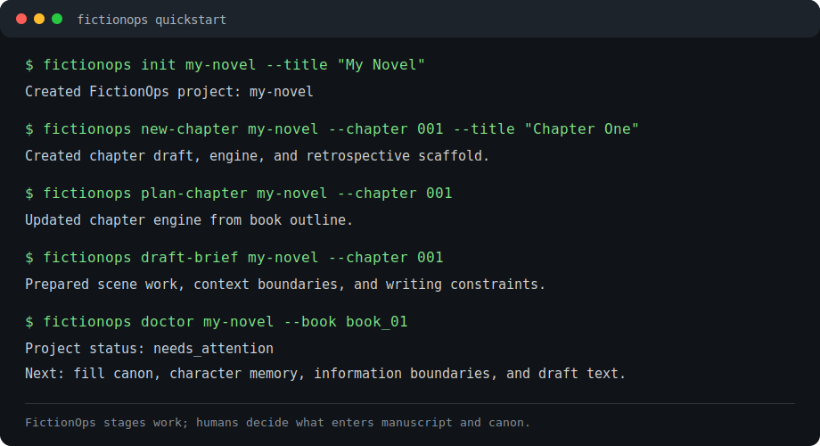

# FictionOps

[](https://github.com/SouthWinter/fictionops/actions/workflows/fictionops-ci.yml)

FictionOps is a local-first CLI workflow system for maintaining long-form fiction projects: outlines, chapter plans, canon, character memory, foreshadowing, information boundaries, AI-assisted task bundles, review gates, and publishable EPUB/Markdown outputs.

It is not a one-click novel generator. It is a project harness for writers who want a large story to stay readable, auditable, and alive across many chapters.

## Why It Exists

Long novels are not just prose files. They accumulate promises, secrets, false leads, character memory, revision decisions, and publishing artifacts. FictionOps keeps those moving parts in ordinary files and gives you CLI checks before the story drifts out of sync.

Use it when you need to:

- migrate a messy existing novel folder into a maintainable structure;
- plan books, chapters, scenes, and draft briefs;
- audit continuity, information release, character files, repeated wording, table structure, and chapter length rhythm;
- hand a bounded task to an AI model or external runner without letting it overwrite canon or manuscript files;
- export clean Markdown, metadata, manifests, and EPUB packages.

## 30 Second Quick Start



Install from the GitHub source checkout today:

```bash
python -m pip install "git+https://github.com/SouthWinter/fictionops.git#subdirectory=fictionops"
```

After the first formal PyPI release, the intended install command is:

```bash
python -m pip install fictionops
```

Create a tiny project:

```bash
fictionops init my-novel --title "My Novel"
fictionops new-book my-novel --book book_01 --title "Book One"
fictionops new-chapter my-novel --book book_01 --chapter 001 --title "Chapter One"
fictionops plan-chapter my-novel --book book_01 --chapter 001
fictionops draft-brief my-novel --book book_01 --chapter 001
fictionops doctor my-novel --book book_01
```

Run the bundled demo from a clone:

```bash
git clone https://github.com/SouthWinter/fictionops.git
cd fictionops/fictionops/examples/demo_novel
fictionops plan-chapter . --chapter 002 --force
fictionops scene-plan . --chapter 002
fictionops draft-brief . --chapter 002 --include-context-content --max-total-chars 4000
fictionops agent-run . --role draft-writer --chapter 002 --out-dir 00_management/agent_runs/ch_002_demo --force
fictionops agent-exec 00_management/agent_runs/ch_002_demo --runner python ../../examples/agent_runner_echo.py
fictionops agent-inbox . --format json
```

## AI/API Integration

FictionOps core does not call models and does not store API keys. It prepares task bundles and saves staged output. External runners do the provider call.

Dry-run an OpenAI-compatible provider such as DeepSeek:

```bash
fictionops agent-exec my-novel/00_management/agent_runs/ch_001 \
  --runner python fictionops/examples/agent_runner_openai_chat.py \
  --dry-run \
  --model deepseek-chat \
  --api-key-env DEEPSEEK_API_KEY \
  --base-url https://api.deepseek.com
```

The same runner can be used with Qwen/DashScope, Kimi/Moonshot, GLM/Zhipu, Doubao/Volcengine Ark, SiliconFlow, OpenAI-compatible local servers, and similar providers. See [model providers](fictionops/docs/model-providers.md).

## Documentation

- [Getting started](fictionops/docs/getting-started.md)
- [CLI guide](fictionops/docs/cli.md)
- [Agent integration guide](fictionops/docs/agent-integration.md)
- [Model providers](fictionops/docs/model-providers.md)
- [Demo tutorial](fictionops/docs/tutorial-demo.md)
- [Migration guide](fictionops/docs/migration.md)
- [Roadmap](fictionops/docs/roadmap.md)
- [0.1.1 release candidate plan](fictionops/docs/release-candidate-0.1.1.md)
- [Promotion kit](fictionops/docs/promotion-kit.md)
- [Chinese README](fictionops/README.zh-CN.md)

## Project Layout

```text
fictionops/
  pyproject.toml
  src/fictionops/       # CLI implementation
  docs/                 # user, agent, release, and compatibility docs
  examples/             # demo novel, legacy migration sample, runner/controller examples
  tests/                # regression tests
```

## Roadmap

The current package is a 0.1.1 pre-alpha onboarding and packaging candidate with 50 CLI commands and 128 regression tests. Near-term work focuses on:

- formal PyPI release;
- clearer demo media and short tutorials;
- real-project migration dogfood;
- controller-loop hardening;
- documentation parity for outside contributors;
- long-term 1.0 compatibility evidence.

See the full [roadmap](fictionops/docs/roadmap.md) and [milestone status](fictionops/docs/milestone-status.md).

## Contributing

Contributions, bug reports, documentation fixes, and workflow feedback are welcome. Start with [CONTRIBUTING](fictionops/CONTRIBUTING.md).

## Citation

If FictionOps helps your writing workflow, research, article, or agent experiment, cite it using [CITATION.cff](CITATION.cff).

## License

FictionOps is released under the [MIT License](LICENSE).
