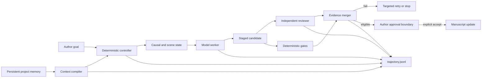

# FictionOps Agent 研究面试案例

最新真实对照实验见 [`evidence/deepseek-benchmark-v2.zh-CN.md`](evidence/deepseek-benchmark-v2.zh-CN.md)：正式 30 次 DeepSeek 调用中，raw recall 为 16.7%，RAG/full 为 100%；full 的可核验引证率达到 100%，但负例误报率仍有 75%。随后加入的 [`preservation verifier`](evidence/deepseek-preservation-verifier-v1.zh-CN.md) 将自动修订 FPR 降到 0%，代价是 actionable recall 降到 83.3%，被挡下的真实问题进入人工 counterevidence 队列后保留 recall 为 100%。16 条 [`counterevidence 作者盲评`](evidence/deepseek-counterevidence-v1.zh-CN.md) 进一步得到 5 uphold、5 withdraw、6 insufficient 和 32 分钟人工成本，并反证了两条过粗的 case-level control 继承。Evidence escalation 把 6 条不足项折叠成 4 个证据请求；受控 [`DeepSeek escalated re-verification`](escalated-reverification.zh-CN.md) 在补入全章后用 1 次调用和 1283 tokens 撤回了“氛围段是填充”的原 finding，精确引文通过确定性 grounding，并通过 [`ledger application`](counterevidence-ledger-application.zh-CN.md) 安全写成 `model_withdrawn`，正文哈希不变。早期 18 次 pilot 见 [`evidence/deepseek-baseline-pilot.zh-CN.md`](evidence/deepseek-baseline-pilot.zh-CN.md)。

## 一句话

FictionOps 研究的不是“让模型一次写出更长的小说”，而是：当创作项目跨越数月、数百万字和多次上下文重置时，如何让模型在持久状态、独立验证、失败恢复和作者权限约束下可靠工作。

## 问题与假设

最初假设是：只要给模型足够精炼的上下文，再让第二次模型调用检查结果，就能完成可靠写作。

真实 dogfood 推翻了这个假设。模型可以生成流畅、结构完整、长度达标的候选，也可以逐项声称约束已经满足，但仍然会：

- 把未解决的文字问题判成已解决；
- 凭空增加人物记忆；
- 在字段之间移动同一个违规结论；
- 进入禁止视角；
- 用主题总结替代场景变化；
- 在局部状态正确时写出文学上不可采纳的整章。

新的系统假设是：

> 长程创作 Agent 的可靠性来自“模型能力 + 外置状态 + 可执行约束 + 独立证据门禁 + 可恢复控制器 + 作者权限”，而不是来自更长 prompt 或模型自评。

## 三次关键失败

### 1. 旧章修订：模型自证产生假阳性

任务是修订一章约 6500 字符的高风险旧章。DeepSeek 正确识别了部分比喻和重复问题，候选也减少了一部分高频模式；但目标词族“冷”没有下降，并新增了原文不存在的记忆片段。语义 verifier 仍声称高优先级问题已经解决，错误给出可批准判断。

由此增加：

- before/after 静态问题账本；
- `metric_deltas` 与 P1/P2 进展一致性门禁；
- reviewer 证据必须落在候选原文；
- 模型语义判断不能覆盖确定性失败；
- 候选只能暂存，必须显式接受。

### 2. 最小上下文盲写：体量正确不等于约束正确

第二次实验只提供约 2056 字符的必要上下文，不提供目标章或后续章正文。模型生成约 8304 个非空白字符，与正式稿不存在 12 字符以上共享 n-gram，说明它确实独立完成了长章；但候选让人物提前形成成熟理论、进入禁止视角，并用多段主题总结收尾。模型 evaluator 又逐项声称约束已经遵守。

由此增加：

- 每条 preserve/forbidden 约束的稳定 ID；
- 对每条约束进行 candidate-grounded 反证；
- 任一约束 `fail/uncertain` 即阻止采纳；
- 因果模拟、人物知识边界和主题问题进入结构化 contract；
- 宽泛维度评分不能覆盖具体约束失败。

### 3. 逐场景生成：状态稳定仍可能文学失败

第三次实验调用 `deepseek-chat` 21 次，约 12 分钟。初稿约 1.19 万非空白字符，逐场景复修后约 1.13 万字符。数量、时间、物件状态和场景交接通过，但候选仍存在主题代答、动作功能重复、对照句过密、段落过长和神秘因果过亮等问题。系统最终停在 `needs_revision_attention`，没有开放采纳。

这次失败说明 controller 的目标不是保证模型一定写好，而是：

1. 保住局部状态；
2. 让失败可定位；
3. 只复修受影响场景；
4. 控制调用预算；
5. 在质量不足时可靠停止。

## 当前架构



模型负责生成和语义判断；controller 负责状态转移、预算、证据合并和权限。`ready_for_approval` 只表示候选具备人工复核资格，不等于接受。

## 现在可以展示的研究能力

### 统一轨迹

每个 session 的 `trajectory.jsonl` 统一记录：

- observation、decision、action；
- context source、authority、selection reason、字符预算和哈希；
- model call、request id、token、费用；
- verification evidence；
- state transition；
- controller/author authority。

### 可复现实验

```powershell
fictionops agent benchmark tests/fixtures/agent_high_risk_review_cases.json `
  --conditions raw,rag,full,no_memory,no_guard,no_contract `
  --runs 5 --format markdown `
  --runner python examples/agent_runner_openai_chat.py --provider deepseek --model deepseek-chat
```

同一模型和案例分别只看片段、增加 RAG、使用完整 workflow 或移除单个组件。报告统一比较命中、证据落地、额外问题、token 和费用。标准答案不进入 prompt。

### 故障注入

```powershell
fictionops agent failure-lab --format markdown
```

当前覆盖源文件漂移、checkpoint 产物篡改、取消后恢复、预算耗尽、畸形 runner receipt、reviewer 证据悬空和禁提前结论。实验同时检查受保护正史哈希是否改变。

当前可复现输出见 [`docs/evidence/failure-lab-current.json`](evidence/failure-lab-current.json)：7/7 故障被检测，受保护哈希保持率 1.0，可恢复场景恢复率 1.0。

## 面试中可以提出的 Claim

可以说：

> 我实现并 dogfood 了一个 artifact-grounded、author-governed 的长程创作 Agent harness。真实模型失败表明，自评式 verifier 会产生假阳性，因此系统把项目状态、证据验证、恢复与权限从模型中外置，并提供可复现的 raw/RAG/workflow 对照和故障注入环境。

不能说：

- FictionOps 已证明提高文学质量；
- 21 次调用一定优于单次调用；
- 三个高风险 fixture 是充分 benchmark；
- 当前结果可泛化到所有模型、语言和创作项目。

## 下一步真实证据

目前统一轨迹、重复实验与 failure lab 是 dogfood 后新增能力，尚未倒写真实 API 对照结果。下一次有价值的实验是固定模型、temperature 和案例，运行 raw/RAG/full/ablation 多次，加入人工盲评，并报告置信区间、作者复核时间、采纳率和最终编辑距离。
